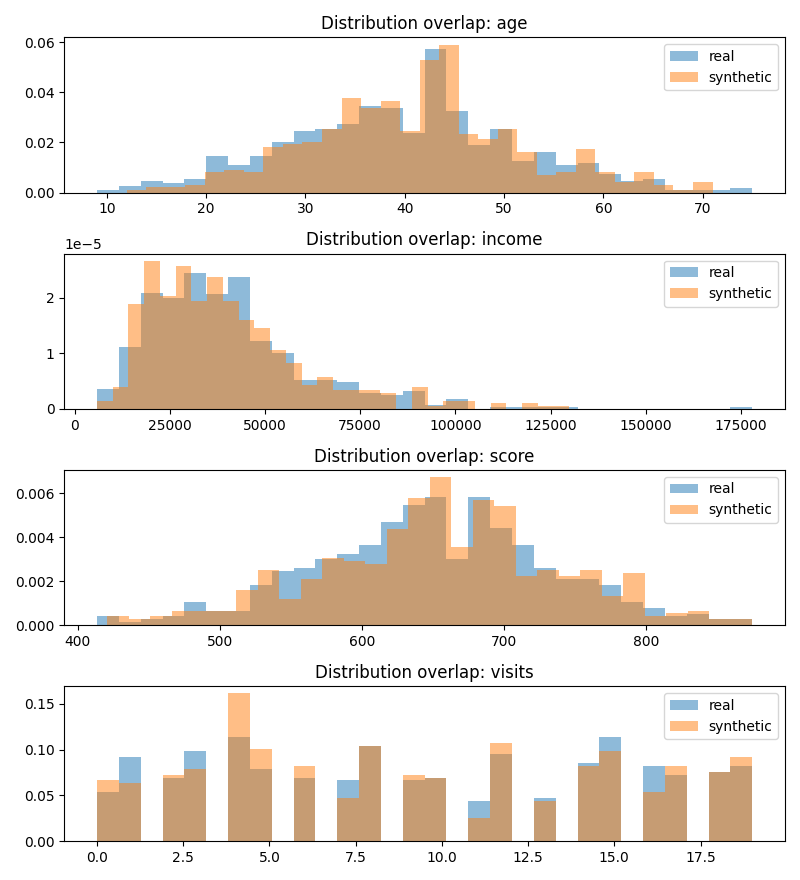
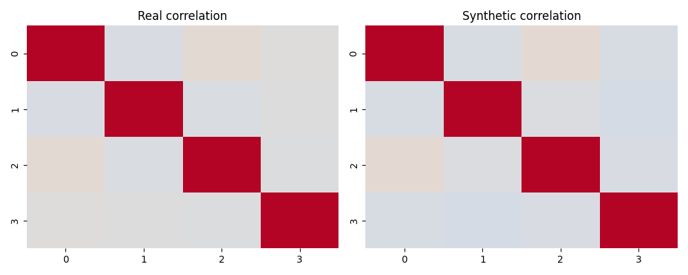
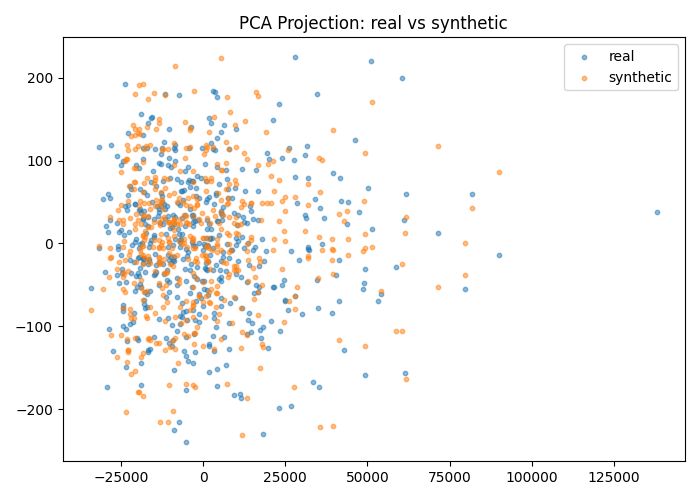
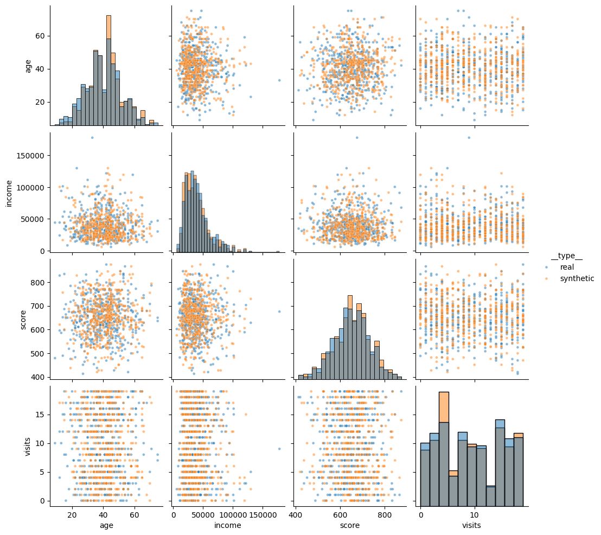

# Synthetic Data Artist, Copula vs VAE Comparative Analysis


---

## Executive Summary

Synthetic data generation enables privacy-preserving data sharing and simulation for analytics, machine learning, and AI model prototyping.  
This project, **Synthetic Data Artist**, compares two distinct paradigms of synthetic tabular data generation:

1. **Gaussian Copula**, A *statistical* method modeling variable correlations.  
2. **Variational Autoencoder (VAE)**, A *deep generative* model learning nonlinear latent representations.

Both are trained on the same dataset and evaluated through a unified metrics and visualization pipeline, including **distribution overlap**, **correlation similarity**, **PCA projection**, and **pairwise visualization**.

---

## Motivation

Real-world data is often **sensitive**, **incomplete**, or **hard to share**. Synthetic data bridges that gap by creating new samples that mimic the structure and statistical behavior of the real dataset.

However, different approaches yield different tradeoffs:
- **Copula** → high statistical fidelity, low flexibility  
- **VAE** → high diversity, potential distortion  

This project quantifies those tradeoffs in a reproducible, visual, and data-driven manner.

---

## Pipeline Overview

```
           ┌─────────────────────────┐
           │       Real Dataset      │
           └────────────┬────────────┘
                        │
                        ▼
        ┌──────────────────────────────┐
        │   Preprocessing & Schema     │
        │  Numeric / Categorical Split │
        └───────────────┬──────────────┘
                        │
        ┌───────────────┴────────────────────┐
        │                                    │
        ▼                                    ▼
┌────────────────┐                ┌────────────────────┐
│    Gaussian    │                │    Variational     │
│  Copula Model  │                │ Autoencoder (VAE)  │
└────────────────┘                └────────────────────┘
        │                                    │
        ▼                                    ▼
┌────────────────────┐             ┌────────────────────┐
│ Synthetic Dataset  │             │ Synthetic Dataset  │
└────────────────────┘             └────────────────────┘
        │                                    │
        └────────────────┬───────────────────┘
                         ▼
         ┌─────────────────────────────────┐
         │ Evaluation & Visualization Suite│
         └─────────────────────────────────┘
```

---

## Methods

### Gaussian Copula (Statistical Model)
The Gaussian Copula method captures correlations between continuous features by:
- Transforming marginals into Gaussian space  
- Estimating a correlation matrix  
- Sampling correlated latent variables  
- Mapping back via inverse CDFs

This ensures **statistical consistency** between synthetic and real distributions.

**Mathematical Sketch:**
\[
Z = \Phi^{-1}(F(X)) \quad \Rightarrow \quad \hat{X} = F^{-1}(\Phi(Z'))
\]
Where:
- \( F \) empirical CDF of features  
- \( \Phi \) standard Gaussian CDF  

---

### Variational Autoencoder (Deep Generative Model)
The VAE learns a latent distribution that encodes complex dependencies between features.

#### Architecture:
- **Encoder:** compresses features into mean (`μ`) and variance (`σ²`)  
- **Latent Layer:** random sampling with reparameterization  
- **Decoder:** reconstructs original space  

\[
z = \mu + \sigma \cdot \epsilon, \quad \epsilon \sim \mathcal{N}(0, I)
\]
\[
\text{Loss} = \text{Reconstruction Loss} + \beta \cdot \text{KL Divergence}
\]

---

## Implementation

### Stack
- Python 3.10  
- PyTorch (VAE)  
- Scikit-Learn, SciPy, NumPy, Pandas  
- Seaborn, Matplotlib  
- Jinja2 for HTML reporting  
- YAML-based config  

### Folder Structure
```

synthetic-data-artist/
├── src/
│   └── main.py
├── data/
│   ├── real_data.csv
│   ├── synthetic_data_copula_run.csv
│   └── synthetic_data_vae_run.csv
├── outputs/
│   ├── copula_run/
│   └── vae_run/
└── reports/

````

---

## Experimental Setup

**Dataset:** Tabular dataset with numerical and categorical features.  
**Parameters:**
| Parameter | Value |
|:--|:--|
| Rows | 500 |
| Random Seed | 42 |
| PCA Components | 2 |
| Histogram Bins | 30 |
| Pairplot Sample | 500 |

---

## Evaluation Metrics

| Metric | Description |
|:--|:--|
| **Distribution Overlap** | Jensen Shannon divergence-based similarity per feature (1.0 = perfect) |
| **Correlation Difference** | Mean absolute difference of feature correlations between real/synthetic |
| **PCA Projection** | Visual latent similarity in reduced 2D space |
| **Pairplot Comparison** | Visual alignment of feature relationships |

---

## Results

### Quantitative Comparison

| Metric | Copula | VAE | Interpretation |
|:--|:--:|:--:|:--|
| **Mean Distribution Overlap** | **0.86** | 0.68 | Copula synthetic data follows real distributions more closely |
| **Mean Correlation Diff** | **0.0197** | 0.1543 | Copula better retains inter-feature relationships |
| **PCA Variance (PC1)** | 0.99998 | 0.99998 | Both align strongly on first principal component |
| **PCA Variance (PC2)** | 0.000015 | 0.000015 | Minor variance captured, similar structure |

---

## Visual Analysis

### Copula

#### Distribution Overlap


#### Correlation Heatmap


#### PCA Projection


#### Pairplot Comparison


---

### Variational Autoencoder

#### Distribution Overlap


#### Correlation Heatmap


#### PCA Projection


#### Pairplot Comparison


---

## Interpretation

### Key Takeaways
| Observation | Insight |
|:--|:--|
| Copula plots are smoother and closely overlap real data histograms | Statistical transformations preserve marginal distributions |
| VAE plots show more dispersion | Latent space diversity introduces variability |
| PCA projections of Copula vs Real overlap almost perfectly | Linear correlations retained |
| VAE PCA points spread wider | Captures nonlinear but less consistent structure |

---

## Business Implications

- **Copula-based synthetic data** is ideal for *regulatory or compliance-sensitive* use cases (finance, healthcare) where maintaining statistical fidelity is crucial.  
- **VAE-based synthetic data** fits *research, simulation, or augmentation* contexts requiring diversity and creativity in generated samples.  

---

## Limitations

| Model | Limitations |
|:--|:--|
| **Copula** | Can’t model nonlinear dependencies or complex categorical relationships |
| **VAE** | Sensitive to scaling, may introduce unrealistic variance for small data |
| **General** | Both assume balanced feature representation; skewed data can bias generation |

---

## Future Work

1. Integrate **CTGAN** and **Gaussian Mixture VAEs** for hybrid modeling.  
2. Introduce **privacy metrics** (e.g., membership inference tests).  
3. Add **conditional generation** (e.g., label-controlled sampling).  
4. Automate **benchmark dashboard** using Streamlit or Plotly Dash.  
5. Compare against **Diffusion Models** and **Copula Flows**.  

---

## Reproducibility

```bash
# Environment setup
pip install -r requirements.txt

# Run Gaussian Copula
python -m src.main --method copula --config config.yaml --run_name copula_run

# Run Variational Autoencoder
python -m src.main --method vae --config config.yaml --run_name vae_run
````

---

## Generated Outputs

```
data/
├── synthetic_data_copula_run.csv
├── synthetic_data_vae_run.csv
outputs/
├── copula_run/metrics.json
├── copula_run/plots/
│   ├── distribution_overlap.png
│   ├── correlation_heatmap.png
│   ├── pca_projection.png
│   └── pairplot_comparison.png
├── vae_run/metrics.json
└── vae_run/plots/
    ├── distribution_overlap.png
    ├── correlation_heatmap.png
    ├── pca_projection.png
    └── pairplot_comparison.png
```
